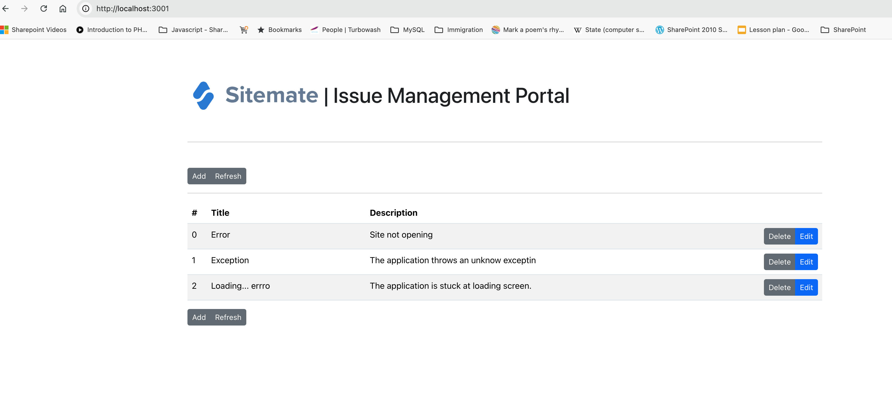
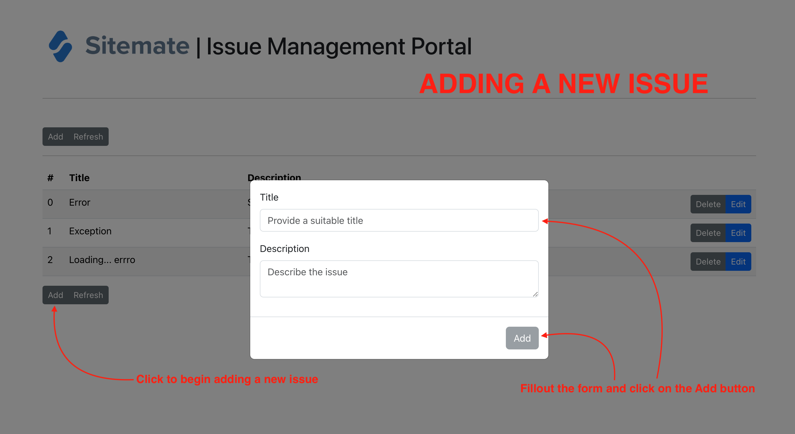

# INTRODUCTION

This is a react application developed to demonstrate CRUD operations betweena fronted client and a backend server.

To work with this application in development mode run the following commands:

```
cd ./client
npm install
npm run dev
```

This should start the webserver for the frontend of the application. The default port of this server is 3001 so the application should be accessible at `http://localhost:3001`

To start the backend, open another terminal window and run the following commands:

```
cd ../server
npm install
npm run dev
```

Now you can access the application via your web browser. Below are some screenshots from the application.

## LANDING PAGE



## ADDING N ISSUE



# VIDEO DEMOS

<div style="position: relative; padding-bottom: 56.25%; height: 0;"><iframe src="https://www.loom.com/embed/2f81238f01f645ffb18fd93c4e4aede0?sid=46f20c8b-bbd2-466e-abc6-b5888cf1f6ee" frameborder="0" webkitallowfullscreen mozallowfullscreen allowfullscreen style="position: absolute; top: 0; left: 0; width: 100%; height: 100%;"></iframe></div>

<div style="position: relative; padding-bottom: 56.25%; height: 0;"><iframe src="https://www.loom.com/embed/d0543096f686450cb6f41749ee220be4?sid=86405b39-2038-451a-9752-e6c1f74d9557" frameborder="0" webkitallowfullscreen mozallowfullscreen allowfullscreen style="position: absolute; top: 0; left: 0; width: 100%; height: 100%;"></iframe></div>
